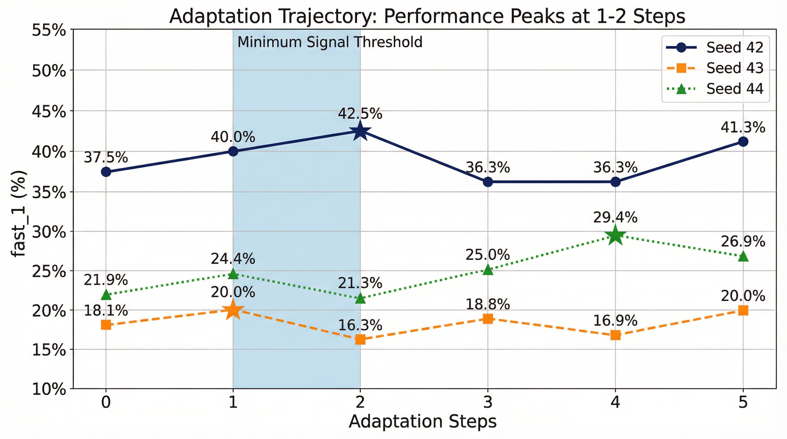

# When Does Test-Time Training Saturate?

[](https://huggingface.co/Jarrodbarnes/KernelBench-RLVR-120b)
[](docs/technical_report.pdf)
[](LICENSE)

> Evidence from Verifiable Execution-Grounded Tasks

This repository contains the code for reproducing the experiments in our paper on test-time training efficiency in verifiable execution-grounded (VEG) tasks. We study GPU kernel optimization using KernelBench as our testbed.


## Key Findings

| Finding | Result | Evidence |
|---------|--------|----------|
| **Minimum signal threshold** | 1-2 gradient steps suffice | Performance peaks then regresses due to over-sharpening |
| **Feedback redundancy** | Prompt-only beats rich feedback | +4.2% advantage across 3 seeds |
| **Regime dependence** | BoA helps at >30% coverage | Search maintains diversity advantage in hard regimes |



## Results Summary

**Table 5.1: Efficiency Frontier (3 seeds, KernelBench L1 eval)**

| Method | fast_1 | std | Correctness | Rollouts |
|--------|--------|-----|-------------|----------|
| **Batch-TTT BoA** | **30.6%** | 11.3% | 91.5% | 960 |
| **SDPO Prompt-Only** | **30.4%** | 7.6% | 91.9% | 320 |
| Best-of-N (K=64) | 30.9% | - | 87.2% | 320 |

## Quick Start

```bash
# Clone with submodules
git clone --recursive https://github.com/jbarnes850/test-time-training.git
cd test-time-training

# Install dependencies
uv sync --extra dev

# Verify installation
uv run python -m scripts.dataset_smoke
uv run python -m scripts.kernelbench_smoke
uv run python -m pytest -q
```

## Reproducing Paper Results

### Prerequisites

- Python 3.11+
- CUDA-capable GPU (16GB+ VRAM)
- `TINKER_API_KEY` for training (contact [Thinking Machines Lab](https://tinker-docs.thinkingmachines.ai/))

```bash
# Set environment variables
export TINKER_API_KEY=your_key_here
export HF_TOKEN=your_token_here  # Optional, for dataset access
```

### Best-of-N Baseline (Table 5.2)

```bash
uv run python -m scripts.best_of_n \
  --split splits/l1_seed42.json \
  --subset eval \
  --k 64 \
  --max_tasks 5
```

### Batch TTT with BoA Selection (Table 5.1)

```bash
uv run python -m scripts.batch_ttt \
  --split splits/l1_seed42.json \
  --subset eval \
  --k 32 \
  --steps 5
```

### SDPO Self-Distillation (Table 5.1)

```bash
# Prompt-only (recommended)
uv run python -m scripts.sdpo_train \
  --split splits/l1_seed42.json \
  --k 32 \
  --steps 1 \
  --prompt_only

# With execution feedback
uv run python -m scripts.sdpo_train \
  --split splits/l1_seed42.json \
  --k 32 \
  --steps 1
```

## Project Structure

```
kernelbench-rl-env/
├── src/                    # Core environment and utilities
│   ├── env/                # Evaluator, telemetry, tasking
│   ├── utils/              # Dataset, code, checkpoint utilities
│   ├── tinker_env.py       # Tinker RL environment
│   └── metrics.py          # Evaluation metrics
├── scripts/                # Entry points
│   ├── best_of_n.py        # Best-of-N baseline
│   ├── batch_ttt.py        # Batch TTT with BoA
│   ├── sdpo_train.py       # SDPO self-distillation
│   ├── eval_task.py        # Single task evaluation
│   ├── train_smoke.py      # RLVR training
│   └── make_split.py       # Create train/eval splits
├── splits/                 # Deterministic data splits
├── artifacts/              # Paper figures
├── docs/                   # Documentation
│   └── technical_report.pdf # Full paper
├── tests/                  # Test suite
└── vendor/                 # Submodules
    ├── KernelBench/        # Evaluation framework
    └── tinker-cookbook/    # Training library
```

## Environment Variables

| Variable | Required | Default | Description |
|----------|----------|---------|-------------|
| `TINKER_API_KEY` | Yes | - | API access for Tinker training infrastructure |
| `HF_TOKEN` | No | - | HuggingFace token for dataset access |
| `KERNELBENCH_EVAL_MODE` | No | `full` | `fast` (5 trials) or `full` (50 trials) |

## Hardware Requirements

- **Evaluation**: CUDA 11.8+, 16GB+ VRAM
- **Training**: Requires Tinker API (cloud infrastructure)
- **Model inference**: 8x A100 80GB for full 120B model

## Using the Trained Model

```python
from transformers import AutoModelForCausalLM, AutoTokenizer
import torch

model = AutoModelForCausalLM.from_pretrained(
    "Jarrodbarnes/KernelBench-RLVR-120b",
    torch_dtype=torch.bfloat16,
    device_map="auto"
)
tokenizer = AutoTokenizer.from_pretrained("Jarrodbarnes/KernelBench-RLVR-120b")
```

## Citation

```bibtex
@article{barnes2026ttt,
  title={When Does Test-Time Training Saturate? Evidence from Verifiable Execution-Grounded Tasks},
  author={Barnes, Jarrod},
  journal={arXiv preprint},
  year={2026}
}
```

## Acknowledgments

- [KernelBench](https://github.com/ScalingIntelligence/KernelBench) (Ouyang et al., 2025)
- [Tinker](https://tinker-docs.thinkingmachines.ai/) (Thinking Machines Lab)

## License

This project is licensed under the Apache License 2.0 - see the [LICENSE](LICENSE) file for details.
