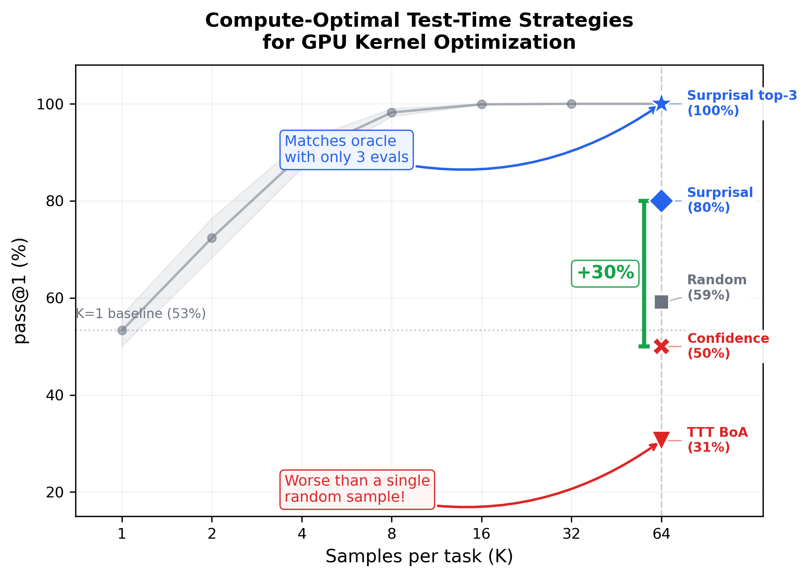
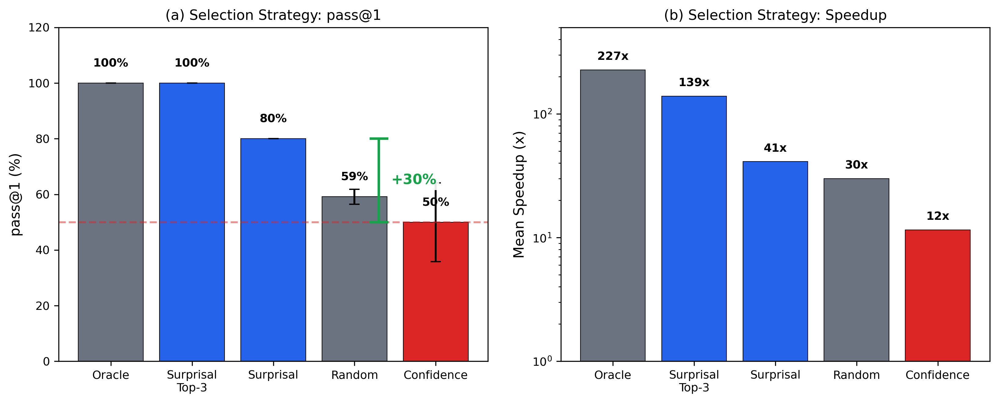

<div align="center">

# Surprisal-Guided Selection

Compute-Optimal Test-Time Strategies for Execution-Grounded Code Generation

[](http://arxiv.org/abs/2602.07670)
[](https://huggingface.co/Jarrodbarnes/KernelBench-RLVR-120b)
[](LICENSE)

[Introduction](#introduction) | [Results](#results) | [Getting Started](#getting-started) | [Reproducing Results](#reproducing-all-experiments) | [Citation](#citation)

</div>

## Introduction

Test-time training (TTT) adapts language models through gradient-based updates at inference. But is adaptation the right strategy? We study compute-optimal test-time strategies for verifiable execution-grounded (VEG) tasks, domains where a deterministic evaluator provides dense, continuous reward signals.

Using [KernelBench](https://github.com/ScalingIntelligence/KernelBench) (250 GPU kernel optimization tasks) as our testbed and a 120B-parameter model (GPT-OSS-120B with LoRA adaptation), we find that **search outperforms minimal adaptation**: Best-of-N sampling achieves 90% task success (18/20 Level-1 tasks) at K=64, while TTT's best checkpoint reaches only 30.6% (3-seed mean), with TTT's "equivalent K" falling below 1, worse than single-sample inference. The failure mode is **over-sharpening**: gradient updates collapse diversity toward mediocre solutions rather than discovering optimal ones.

Our main contribution is **surprisal-guided selection**: selecting the *highest-surprisal* (lowest-confidence) correct sample yields 80% success vs. 50% for most-confident selection. Extending to surprisal-guided-top3 matches oracle performance at 100%. The model's probability distribution maps frequency, not quality. Rare, hardware-optimized kernels occupy the Expert Tail that surprisal recovers at zero cost.

<p align="center">
  
</p>

*Best-of-N scaling (gray) saturates at K=16 (99.9%). At K=64, TTT (31%, red) is 2x worse than random selection (59%); surprisal-guided (blue) matches oracle. The +30% bracket: confidence (50%) vs. surprisal (80%).*

<p align="center">
  
</p>

*Dual-loop architecture. The outer loop trains a base policy via RLVR on 80 tasks. The inner loop compares test-time strategies (TTT, Best-of-N, selection mechanisms) under matched compute budgets against the same execution-grounded evaluator.*

---

## Results

Best-of-N covers all 20 KernelBench Level-1 eval tasks; selection analysis uses Subset 1 (5 tasks, 2 seeds). **fast_1** measures the fraction of samples that are both functionally correct and achieve speedup > 1x over the reference PyTorch implementation.

### Search Outperforms Adaptation

Best-of-N at K=64 achieves 90% task success (18/20 tasks). TTT's Best-of-Adaptation reaches 30.6% fast_1 (3-seed mean). Interpolating on the scaling curve, TTT falls below K=1 (53.3%), meaning it is worse than drawing a single random sample. Performance saturates at K=16. Modest sampling budgets suffice for dense-reward VEG tasks.

### Surprisal-Guided Selection

Given K=64 samples per task, standard practice selects the most confident output. We find the opposite works: selecting the *least* confident correct sample achieves 80% fast_1 vs. 50% for confidence-guided (+30pp, Cohen's h = 0.64). Evaluating just the top 3 by surprisal and picking the fastest matches oracle at 100%. The signal is already in the log-probabilities. No additional inference cost.

<p align="center">
  
</p>

*Selection strategy comparison (Subset 1, 2 seeds). (a) Surprisal-guided achieves 80% fast_1 with zero variance; confidence-guided achieves 50% with std=14.1%. (b) Mean speedup: surprisal-guided (41x) vs. confidence-guided (12x). Primary comparison uses 5 tasks x 2 seeds; Best-of-N covers all 20 L1 tasks.*

### Over-Sharpening Explains TTT Failure

TTT gradient updates concentrate probability on mediocre early successes, collapsing diversity. Probing 320 fixed Best-of-N samples under each TTT checkpoint, the Spearman rho between NLL and speedup deepens from -0.198 (step 0) to -0.275 (step 8). In the bottom quartile (where selection operates), rho nearly doubles from -0.24 to -0.44. Adaptation makes the model progressively more confident about its worst solutions.

<p align="center">
  
</p>

*Adaptation trajectory across 3 seeds. Performance peaks at 1-2 steps then regresses. Stars mark BoA-selected checkpoints. Over-sharpening persists across learning rates spanning three orders of magnitude.*

---

## Getting Started

### Requirements

- Python 3.11+
- CUDA 11.8+, 16GB+ VRAM (for kernel evaluation)
- `TINKER_API_KEY` for model inference and training ([Thinking Machines Lab](https://tinker-docs.thinkingmachines.ai/))

All experiments call the 120B model via the Tinker inference API. There is no local-only mode.

### Installation

```bash
git clone --recursive https://github.com/jbarnes850/test-time-training.git
cd test-time-training
uv sync --extra dev
```

### Quick Start

```bash
export TINKER_API_KEY=your_key_here

# Run Best-of-N with selection analysis on 5 tasks (~15 min)
uv run python -m scripts.best_of_n \
  --split splits/l1_seed42.json \
  --subset eval \
  --k 64 \
  --max_tasks 5
```

---

## Reproducing All Experiments

```bash
export TINKER_API_KEY=your_key_here
export HF_TOKEN=your_token_here  # Optional, for dataset access
```

**Best-of-N** (primary baseline, all 20 L1 tasks):
```bash
uv run python -m scripts.best_of_n \
  --split splits/l1_seed42.json --subset eval --k 64 --max_tasks 20
```

**Batch TTT** with Best-of-Adaptation:
```bash
uv run python -m scripts.batch_ttt \
  --split splits/l1_seed42.json --subset eval --k 32 --steps 5
```

**SDPO** ([Self-Distilled Policy Optimization](https://arxiv.org/abs/2601.20802)):
```bash
# Prompt-only mode
uv run python -m scripts.sdpo_train \
  --split splits/l1_seed42.json --k 32 --steps 1 --prompt_only

# With execution feedback
uv run python -m scripts.sdpo_train \
  --split splits/l1_seed42.json --k 32 --steps 1
```

| Variable | Required | Default | Description |
|----------|----------|---------|-------------|
| `TINKER_API_KEY` | Yes | - | Model inference and training via [Tinker](https://tinker-docs.thinkingmachines.ai/) |
| `HF_TOKEN` | No | - | HuggingFace dataset access |
| `KERNELBENCH_EVAL_MODE` | No | `full` | `fast` (5 trials) or `full` (50 trials) |

**Hardware**: Kernel evaluation requires CUDA 11.8+ with 16GB+ VRAM. Training and inference use Tinker (cloud). Loading the full 120B model locally requires 8x A100 80GB.

---

## Using the Trained Model

```python
# pip install accelerate  # Required for device_map on large models
from transformers import AutoModelForCausalLM, AutoTokenizer
import torch

model = AutoModelForCausalLM.from_pretrained(
    "Jarrodbarnes/KernelBench-RLVR-120b",
    torch_dtype=torch.bfloat16,
    device_map="auto",
)
tokenizer = AutoTokenizer.from_pretrained("Jarrodbarnes/KernelBench-RLVR-120b")
```

This model is 120B parameters. `device_map="auto"` requires the `accelerate` package and distributes across available GPUs. See the [model card](https://huggingface.co/Jarrodbarnes/KernelBench-RLVR-120b) for details.

---

## Citation

```bibtex
@article{barnes2026surprisal,
  title={Surprisal-Guided Selection: Compute-Optimal Test-Time Strategies
         for Execution-Grounded Code Generation},
  author={Barnes, Jarrod},
  journal={arXiv preprint arXiv:2602.07670},
  year={2026},
  url={http://arxiv.org/abs/2602.07670}
}
```

## Acknowledgments

- [KernelBench](https://github.com/ScalingIntelligence/KernelBench) (Ouyang et al., 2025)
- [Tinker](https://tinker-docs.thinkingmachines.ai/) (Thinking Machines Lab)

## License

Apache License 2.0. See [LICENSE](LICENSE).
